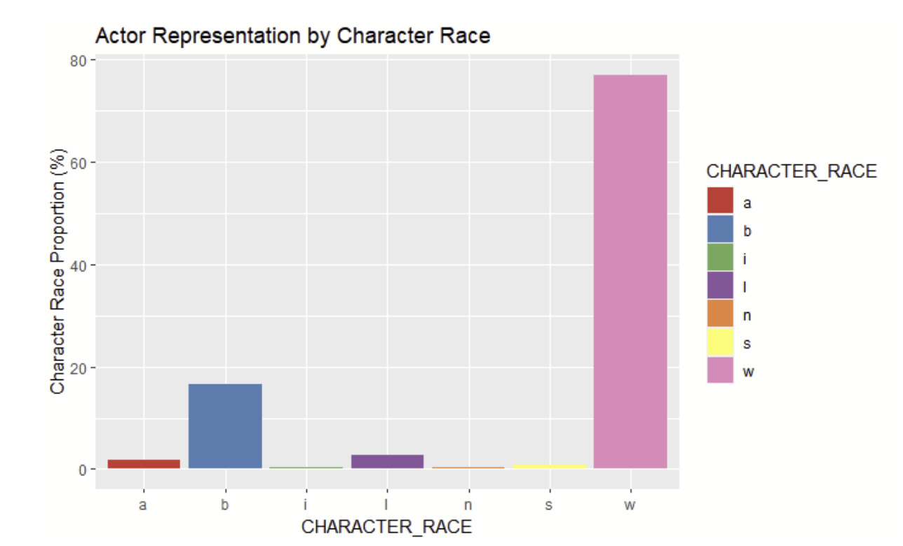
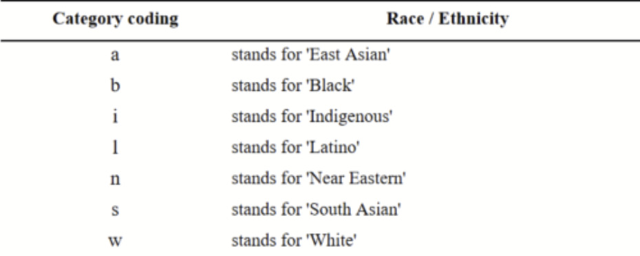
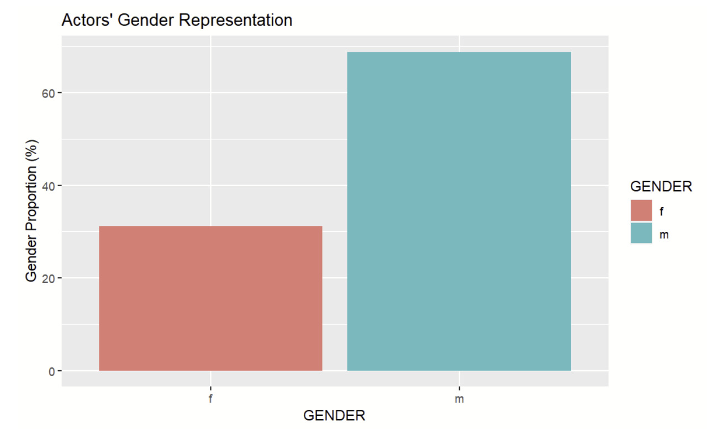
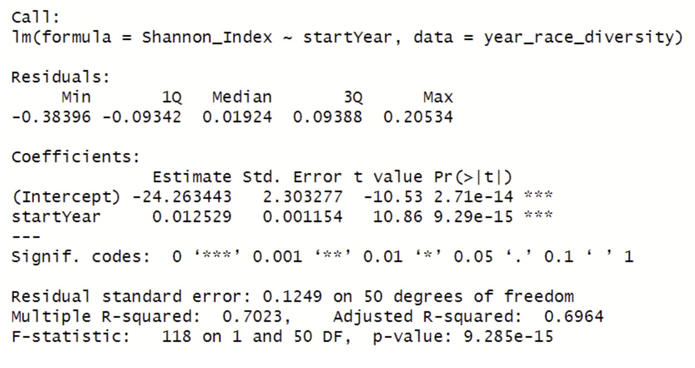
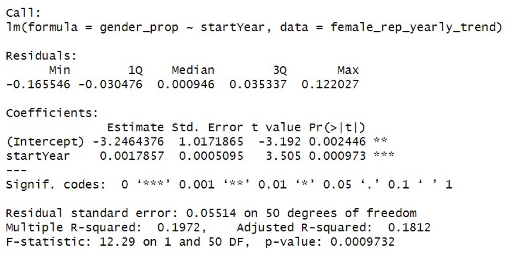

```{r setup, include=FALSE}
knitr::opts_chunk$set(echo = TRUE)
```

# Influence of the movie release year on actor diversity & gender representation

## 1. Research question

This project is aimed at the following research question: 'How does the movie release year influence the actor diversity, measured by the Shannon index, and gender representation in the film industry?'

The intent of addressing this research question is to conduct a comprehensive examination of the available data to uncover insights into the industry's progress towards diversity in our society. This analysis aims to reveal various aspects of inclusivity and diversity, such as the representation of excluded ethnic groups or races in key roles within the film and entertainment industry. Since it has been proven how these factors may relate to audience reception and a series of social issues.

## 2. Hypothesis

### 2.1 Diversity

H0 = The year a movie is released has no effect on the actors' race diversity index.

H1 = The year a movie is released has an effect on the actors' race diversity index.

### 2.2 Gender

H0 = the year a movie is released has no effect on the female gender representation.

H1 = the year a movie is released has an effect on the female gender representation.

## 3. Methodology

### 3.1 Datasets

From the IMDb Non-Commercial Datasets (IMDb Non-Commercial Datasets, n.d.) the following datasets were used:

-   name.basics.tsv.gz

-   title.basics.tsv.gz

Additionally, the Harvard Actor Racial Line Dataset (Svaikovsky, Meisner, Kraicer & Sims, 2018a) was used. Previously, this research targeted race/ethnic group representation in each of the main movie genres (Svaikovsky, Meisner, Kraicer & Sims, 2018b). Therefore, taking this research to the next step by performing a quantitative analysis on diversity represents a forward leap and gives hints to the importance of race representation in what society watches at home and movie theaters.

### 3.2 Variables

The merged dataset in its entirety consists of 31 variables. However, for this analysis a selection of 3 relevant variables will be used, namely: 'Character_race', 'Gender' and 'Startyear'.

### 3.3 Research method

Linear regression analysis will be performed on two separate subjects to investigate the link between the independent variable startYear, and the two dependent variables, namely 'Shannon index' and 'gender'. Using this statistical method allows the understanding of change over time for these variables. This approach makes it possible to gain data-driven insights regarding diversity and gender representation of the film industry.

The formula for the linear regression is:

\[ Y = \beta_0 + \beta_1X_1 \]

Where:

-   Y is the dependent variable, which are the Shannon Index and Female Gender Proportion.

-   β0 is the intercept.

-   β1 is the coefficient for the independent variable, which is the Movie Release Year

-   X1 is the value of the independent variable

#### 3.3.1 Diversity

|                 |                               |
|-----------------|-------------------------------|
| ***Variables*** | ***Description***             |
| CHARACTER_RACE  | The ethnicity of the actors   |
| Startyear (X1)  | The release year of the movie |

*Table 1: Diversity variables*

In this case we use the Shannon index as the dependent variable (Y), which is an index that measures diversity, based on the actor's ethnicity. This has to be calculated using the 'CHARACTER_RACE' variable from the dataset and calculating the proportion each race represents from the community-sample which in this case is the set of movies released per year. Shannon Index is a dimensionless metric and the higher the number is the more diversity is within the population, so an increment on this index denotes an improvement in actors' diversity.

The formula to calculate the Shannon index is:

\[
H = -\sum_{i=1}^{n} (p_i \cdot \ln(p_i))
\]

Where:

-   H is the Shannon index, which represents the actor diversity.

-   S is the number of different categories.

-   pi represents the proportion of the total occurrences that belong to the ith category, which is calculated by the proportion of the "CHARACTER_RACE" variable in every year.

Figure 1 shows the proportion of the actor representation by character race and figure 2 shows the category coding for each race/ethnicity.





#### 3.1.2 Gender

|                 |                               |
|-----------------|-------------------------------|
| ***Variables*** | ***Description***             |
| GENDER (Y)      | The gender of the actor       |
| Startyear (X1)  | The release year of the movie |

*Table 2: Gender variables*

Apart from racial misrepresentation, it is well known that the female gender is under-represented within many professions in our society and unfortunately after exploring the raw datasets this was confirmed as seen in figure 3. So in an effort to explore if this problem had improved in recent years more research was needed.



## 4. Analysis Results

### 4.1 Diversity - Linear Regression Analysis

#### 4.1.1 Calculating the Shannon index

The first step in analyzing the merged dataset was to aggregate actor race diversity by movie release year for then calculating the Shannon index per movie release year. Before proceeding to the analysis phase, filtering out data points prior to 1971 and from 2023, was required due to limited information on actors . Afterwards a linear regression on Shannon index was conducted with the movie release year as the independent variable.


As the graph in figure 4 and 5 show, the diversity increases over time but not consistently. The Shannon index was below 0.3 in 1970 and it turned out to be close to one in 2020. It represents a total increase of \~ 0.7 half a century. However, the diversity trend was not consistent, in 1980 the index reached the lowest level and it dropped down again in 2010.


#### 4.1.2 Interpretation of the regression analysis

Appendix A shows the results of the linear regression. The p-value in the model is below the threshold of 0.05 so our results are statistically significant and the null hypotesis can be rejected**;** this means that the year a movie is released has an effect on the actors' race diversity index because the Shannon index clearly increases over time indicating a positive effect on actor race diversity. Particularly, if the start year goes up by one unit, the Shannon index increases by 0.0125.

Furthermore, The R squared is equal to 0.7 meaning that the proportion of variation in the dependent variable that can be explained or predicted by the regression model is equal to 0.7; the prediction cannot be 100% accurate and only additional variables could improve the model.

#### 4.2.3 Diversity regression formula

The formula to calculate the diversity is:

Y1 = -24.263 + 0.01259X1

Where Y1 is the Shannon index and X1 is the movie release year.

### 4.2 Gender - Linear Regression Analysis

#### 4.2.1 Gender representation over time

The initial step for investigating gender representation was to aggregate actors' gender representation by movie release year for then calculating the proportion of female gender out of the total actors corresponding to that year. Next a data filtering equally to the diversity regression analysis was performed. Furtherlmore, a linear regression on female gender proportion was conducted with the movie release year as the independent variable.


The graph in figure 6 shows that the gap in gender representation between male and female is decreasing over time. However, the reduction is not so significant since the gap is still big in 2020. Figure 7 shows the increase in the female gender representation over time.


#### 4.2.2 Interpretation of the regression analysis

Appendix B shows the result of the linear regression. The p-value in this model is below the threshold of 0.05 so the results are statistically significant and the null hypothesis can be rejected;this means that the year a movie is released has an effect on the female gender representation because the female gender representation increases over time. In particular, if the start year goes up by one unit, the female gender representation increases by 0.00178.

Furthermore, The R squared is equal to 0.20 meaning that the proportion of variation in the dependent variable that can be explained or predicted by the regression model is equal to 0.20; the prediction cannot be 100% accurate.

#### 4.2.3 Female gender representation regression formula

The formula to calculate the female gender representation is:

Y2 = -3.246 + 0.00179X1

Where Y2 is the female gender representation and X1 is the movie release year.

## 5. Conclusion

In conclusion, the analysis of the actor diversity and gender representation showed some interesting insights. Firstly, regarding actor diversity we discovered that there is statistical significance that a movie's release year affects the actors' race diversity index.

For race diversity, we found statistically significant results meaning that the race diversity increases over time. However, the gap between male and female is still considerable; meaning gender inequality should be a priority for discussion and as a research topic.

Further analysis including a wider set of variables could provide a clearer picture on how race diversity has changed over time. For example adding film genre as a regression variable may show an effect or relationship that is currently masked by analyzing all types of movies together. Similarly, for researching gender representation looking at proportions through different genres would deepen the understanding of how and why females are still underrepresented or even discover if there is any improvement in specific gender. Furthermore, it could be interesting to repeat the analysis in ten to fifteen years to see whether the gender gap has decreased anymore.

Other ways to improve the analysis presented are collecting additional data on actors apart from Hollywood ones or even updating this dataset, since the actor racial lines dataset was obtained from a study published in 2018.

## 6. Bibliography

-   Svaikovsky, V.; Meisner, A.; Kraicer, E.; Sims, M., 2018a, "Racial Lines",<https://doi.org/10.7910/DVN/KERZQY>, Harvard Dataverse, V3, UNF:6:/qYtamtOhoREW8pHL1R47A== [fileUNF] Retrieved from <https://dataverse.harvard.edu/api/access/datafile/:persistentId?persistentId=doi:10.7910/DVN/KERZQY/E3ODSJ>

-   Svaikovsky, V.; Meisner, A.; Kraicer, E.; Sims, M., 2018b, "Racial_Lines_2018.pdf", Racial Lines,<https://doi.org/10.7910/DVN/KERZQY/SN8AMT>, Harvard Dataverse, V3

-   IMDb Non-Commercial Datasets. (n.d.). IMDb. Retrieved from: <https://developer.imdb.com/non-commercial-datasets/>

## 7. Appendices

### Appendix A. Linear Regression Results of Shannon Diversity Index Over Time



### Appendix B. Linear Regression Results of Female Gender Representation Over Time


